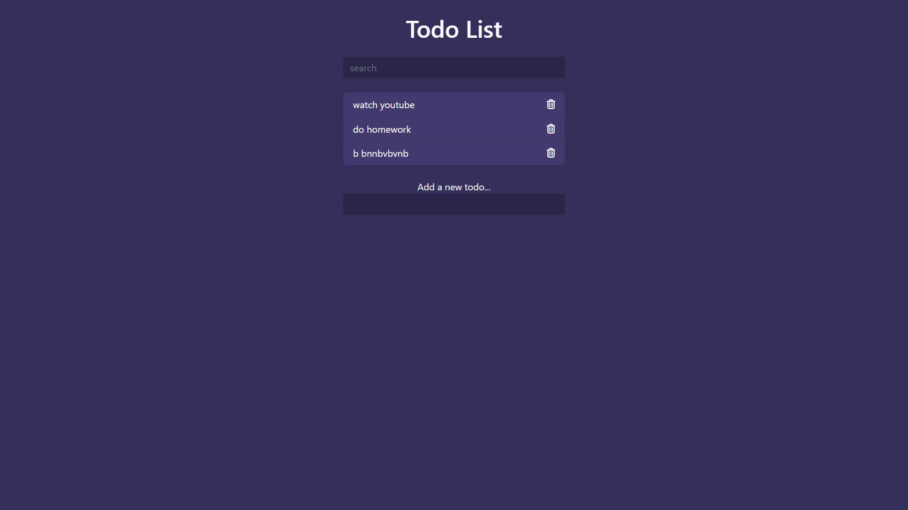

# Todo List

It is a simple website where we can  list everything that you have to do.
## Authors

- [Bharadwaj T](https://github.com/bharadwaj-t4)


## Features

- Responsive
- Fullscreen mode
- Cross platform
- Search option avilable


## Description
It is a Intresting website used for listing everything that you have to do.
By using this you can add list of activities and manage it. After the completion of the tasks we can remove it.It includes a intresting option SEARCH so we can find the activities so easily, and it have a good interface.
## FAQ

#### 1. Is it Responsive?

Yes it is a responsive. And it consist a good interface.

#### 2.  What is the purpose of todo list?

we can easily store" list things that you have to do"

## Installation
just clone the the project open in the browser.

    
## Screenshots



```